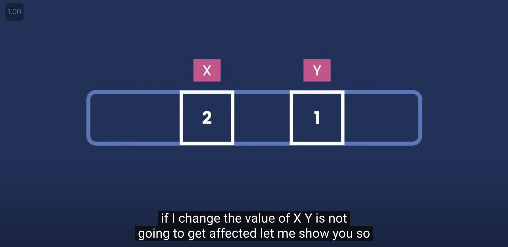
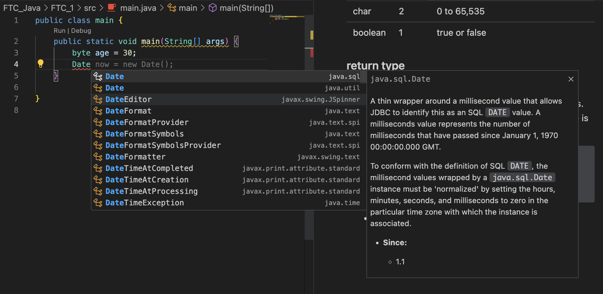

## lesson 3

### pass variables to other variables

- In Java, you can pass the value of one variable to another variable.

```java
int x = 10;
int y = x;
System.out.println(y); // 10
```

### exercise

- declear a primitive type variable x and set it to 1
- declear a other primitive type variable y and set it to x
- change the value of x to 2
- print the value of y



### primitive types and reference types

- In Java, there are two types of data types: primitive types and reference types.
- Primitive types are basic data types that store simple values, such as numbers and characters. eg: int, float, double, char, boolean
- Reference types are more complex data types that store references to objects in memory. eg: String, Array, Class

### primitive types

| Type    | Bytes | Range                                                   |
| ------- | ----- | ------------------------------------------------------- |
| byte    | 1     | -128 to 127                                             |
| short   | 2     | -32,768 to 32,767                                       |
| int     | 4     | -2,147,483,648 to 2,147,483,647                         |
| long    | 8     | -9,223,372,036,854,775,808 to 9,223,372,036,854,775,807 |
| float   | 4     | 1.4E-45 to 3.4E+38                                      |
| double  | 8     | 4.9E-324 to 1.8E+308                                    |
| char    | 2     | 0 to 65,535                                             |
| boolean | 1     | true or false                                           |

### return type

- In Java, a method can have a return type, which specifies the type of value that the method returns.
- If a method does not return a value, its return type is void.

```java
returnType Name(){
    // code
}
```

- some functions can return a value, and some functions can return nothing.

### Data types with different pakages

- same class name can be used in different packages.

  

- eg: `java.util.Date` and `java.sql.Date`
- after we choose the package, VSCode will automatically import the package.
- we will talk about packages in the future.

now we have Date variable in java.util package, let's give it a name like: now
we set this here we need to use 'new' operator to allocate memory for this variable.

- this is a difference between primitive types and reference types.
- when declaring a primitive type, we just need to declare the type and the name of the variable.
  don't need to allocate memory for it.
- Java runtime environment will automatically allocate memory for it.
- when declaring a reference type, we need always to use 'new' operator to allocate memory for it.
- we don't have to release memory for it, Java runtime environment will automatically take care of it.

```java
// after 'new' we need repeat the name of the class then we need add parentheses followed by a semicolon.
Data now = new Date();

// the now variable we defined is an instance of the Date class.

// if Object or class have member variables, we can use the dot operator to access them.
now.getTime();

// primitive types don't have member variables.
// if using dot operator on primitive types u wont see any member variables.


```

#### exercise

print now date and time.

```java
import java.util.Date;

public class lesson3 {
    public static void main(String[] args) {
        Date now = new Date();
        System.out.println(now);
    }
}
```

### poiint class

- java.awt
- declear a variable of point1
- in the point class, there are two member variables x and y
- declear a variable of point2 and set it to point1
- use dot function to see the x and y value of point 1
- change the x value of point1 to 2

- remember that: reference types are copied by reference, not by value.
- primitive types are copied by value.

### String and string literal

```java
System.out.println("Hello, World!");
// this is a string literal or string value.

// try String class from java.lang package
String str = new String("Hello, World!");

// other short way to declare a string
String str = "Hello, World!";
```

#### exercise

- declear two string variables, str1 and str2
- combine str1 and str2 and store the result in str1
- print the result

- change the value of str1 to "Java FTC, "
- combine str1 and str2 and store the result in str1
- print the result

```java
public class lesson3 {
    public static void main(String[] args) {
        String str1 = "Hello, ";
        String str2 = "World!";
        str1 = str1 + str2;
        System.out.println(str1);

        str1 = "Java FTC, ";
        str1 = str1 + str2;
        System.out.println(str1);
    }
}
```

### String class dot operator

- String class has many member functions.
- str1.endsWith(str2) - check if str1 ends with str2
- str1.startsWith(str2) - check if str1 starts with str2
- str1.length() - get the length of str1
- str1.indexOf(str2) - get the index of str2 in str1
- str1.replace(str2, str3) - replace str2 with str3 in str1

#### exercise

- find out what is endWith and startWith function return.

- try length function
- try indexOf function ('h', 'Ray')
- try replace function ('Hello', 'Hi')

```java
public class lesson3 {
    public static void main(String[] args) {
        String str1 = "Hello, World!";
        System.out.println(str1.endsWith("World!"));
        System.out.println(str1.startsWith("Hello"));

        System.out.println(str1.length());
        System.out.println(str1.indexOf("H"));
        System.out.println(str1.indexOf("Ray"));
        System.out.println(str1.replace("Hello", "Hi"));

        // print the original string
        System.out.println(str1);
        // the reson why the original string is not changed is because the replace function returns a new string. String in Java is immutable.
    }
}
```

### String class dot operator

- str1.toUpperCase() - convert str1 to uppercase
- str1.toLowerCase() - convert str1 to lowercase
- str1.trim() - remove leading and trailing whitespace from str1

#### exercise

- try toUpperCase function
- try toLowerCase function
- try trim function

```java
public class lesson3 {
    public static void main(String[] args) {
        String str1 = "Hello, World!";
        System.out.println(str1.toUpperCase());
        System.out.println(str1.toLowerCase());
        System.out.println(str1.trim());
    }
}
```

### back slash

- back slash is an escape character in Java.
- \n - new line
- \t - tab
- \b - backspace
- \r - carriage return
- \f - form feed
- \\ - back slash
- \' - single quote
- \" - double quote

#### exercise

- print "Hello, World!" in two lines

```java
public class lesson3 {
    public static void main(String[] args) {
        System.out.println("Hello,\nWorld!");
    }
}
```

- print "Hello, World!" with a tab between Hello, and World!

```java
public class lesson3 {
    public static void main(String[] args) {
        System.out.println("Hello,\tWorld!");
    }
}
```

### escape character
