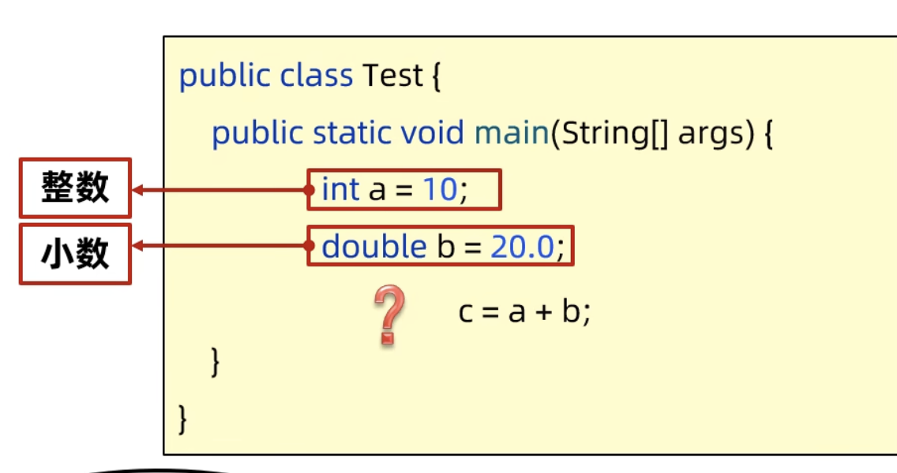
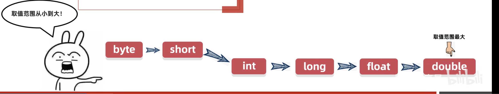
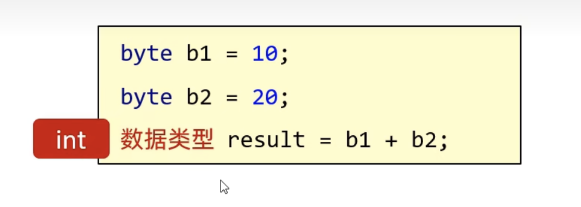

## lesson 5

### Recape

#### back slash

- back slash is used to escape special characters in a string.

#### Array

- storing multiple values
- two ways we can define array

  - int[] numbers = new int[5];
  - int[] numbers = {1, 2, 3, 4, 5};

- 2D Array

  - int[][] numbers = new int[2][3];
  - int[][] numbers = {{1, 2, 3}, {4, 5, 6}};

- 3D Array
  - int[][][] numbers = new int[2][3][4];
  - int[][][] numbers = {{{1, 2, 3, 4}, {5, 6, 7, 8}, {9, 10, 11, 12}}, {{13, 14, 15, 16}, {17, 18, 19, 20}, {21, 22, 23, 24}}};

#### Scanner

- why we need scanner?

  - the more flexible way to get input from the user
  - eg. int a = 10; // we type 10 in the code to initialize a
  - // the more flexible way should be like:
    // when the program runs, it will ask user to input a number and then assign the number to a

- do we need follow that stpes?:

  - physically connect the keyboard to the computer
  - pair the keyboard
  - check connection
  - verify the keyboard is working
  - record the keyboard's MAC address
  - get the keyboard's input ....

- No, we don't need to do that. Java have a built-in class called 'Scanner' to handle the input from the user.

- so basically, we just focus on this:

  - Java have a built-in class called 'Scanner' to handle the input from the user.

    - import the Scanner class (find where the Scanner class is located)

    ```java
    import java.util.Scanner;
    ```

    - create a Scanner object

    ```java
    Scanner sc = new Scanner(System.in); // remember in Java how we print out things? 'System.out'
    ```

    - use the Scanner object to get input from the user

    ```java
    int a = sc.nextInt();
    ```

#### Exercise 1

- create a program that asks the user to input 5 numbers and then print out the sum of the 5 numbers.

```java
import java.util.Scanner;

public class ScannerExample01 {
    public static void main(String[] args) {
        Scanner sc = new Scanner(System.in);
        int sum = 0;
        for (int i = 0; i < 5; i++) {
            System.out.println("Please input a number: ");
            sum += sc.nextInt();
        }
        System.out.println("The sum of the 5 numbers is: " + sum);
    }
}
```

#### Add int with Double



- in Java, when we need to add an int with a double, we can't just do it directly. We need to convert the int to a double first.

- variable type casting

  - int -> double

    ```java
    int a = 10;
    double b = (double) a;
    ```

  - double -> int

        ```java
        double a = 10.5;
        int b = (int) a;
        ```

    

- the casting need to follow the range of the variable type

  - byte -> short -> int -> long -> float -> double

  - rule 1: if the variable type is smaller than the target variable type, we can do the casting directly.
  - rule 2: byte short and char will be promoted to int when doing arithmetic operations.



#### Exercise 2

- if byte b1 = 10; byte b2 = 20; what is the result of b1 + b2?

  - the result is 30, because b1 and b2 will be promoted to int when doing arithmetic operations.

- if int i = 10; long n = 100L; double d = 20.0; - what is the result of i + n + d?

  - the result is 130.0, because i will be promoted to long when doing arithmetic operations. then long will be promoted to double when doing arithmetic operations.

- if byte b = 10; short s = 20; long n = 100L; what is the result of b + s + n?

  - the result is 130, because b and s will be promoted to int when doing arithmetic operations. then int will be promoted to long when doing arithmetic operations.

#### foce casting

- force casting is used to convert a larger variable type to a smaller variable type.

- force casting is not recommended because it may cause data loss.

Syntax:
The destination variable type = (destination variable type) the source variable;

```java
double d = 10.5;
int i = (int) d;

int a = 300;
byte b = (byte) a; // the byte range is -128 to 127, so we can't convert 300 to a byte.
```

#### Exercise 3

- write a program that asks the user to input a double number and then print out the int part of the double number.

```java
import java.util.Scanner;

public class ScannerExample02 {
    public static void main(String[] args) {
        Scanner sc = new Scanner(System.in);
        System.out.println("Please input a double number: ");
        double d = sc.nextDouble();
        int i = (int) d;
        System.out.println("The int part of the double number is: " + i);
    }
}
```

#### Exercise 4

- write a program that asks the user to input a double number and then print out the decimal part of the double number.

```java
import java.util.Scanner;

public class ScannerExample03 {
    public static void main(String[] args) {
        Scanner sc = new Scanner(System.in);
        System.out.println("Please input a double number: ");
        double d = sc.nextDouble();
        int i = (int) d;
        double decimal = d - i;
        System.out.println("The decimal part of the double number is: " + decimal);
    }
}
```

#### if-else

- if-else is used to make decisions in a program.
- if the condition is true, the code inside the if block will be executed.

first syntax:

```java
if (condition) {
    // code block
}

// eg
int myScore = 10;
if (myScore < 60) {
    System.out.println("I am gona to die");
}
System.out.println("Hope my mom won't kill me");
```

so if the condition is true, the code block will be executed. If the condition is false, the code block will be skipped.

#### Exercise 5

- write a program that asks the user to input a number and then only print out if the number is even.

```java
import java.util.Scanner;

public class ScannerExample04 {
    public static void main(String[] args) {
        System.out.println("Program start.... \n");
        Scanner sc = new Scanner(System.in);
        System.out.println("Please input a number: ");
        int number = sc.nextInt();
        if (number % 2 == 0) {
            System.out.println("\nThe number is even.");
        }
        System.out.println("\nThe program is done.");
    }
}
```

#### else

- if the condition is false, the code inside the else block will be executed.

second syntax:

```java
if (condition) {
    // code block
} else {
    // code block
}

// eg
int myScore = 70;
if (myScore < 60) {
    System.out.println("I am gona to die");
} else {
    System.out.println("I am safe");
}
System.out.println("Hope my mom won't kill me");
```

#### Exercise 6

- write a program, girl ask the user to input how old are you, if user age is greater than 18, print out "I wana tobe your girlfriend", otherwise print out "I am sorry, you are too young".

```java
import java.util.Scanner;

public class ScannerExample05 {
    public static void main(String[] args) {
        System.out.println("Program start.... \n");
        Scanner sc = new Scanner(System.in);
        System.out.println("Please input your age: ");
        int age = sc.nextInt();
        if (age > 18) {
            System.out.println("\nI wana tobe your girlfriend.");
        } else {
            System.out.println("\nI am sorry, you are too young.");
        }
        System.out.println("\nThe program is done.");
    }
}
```

### else-if

- if the condition is false, the code inside the else block will be executed.

third syntax:

```java

if (condition1) {
    // code block
} else if (condition2) {
    // code block
} else {
    // code block
}

// eg
int myScore = 70;
if (myScore < 60) {
    System.out.println("I am gona to die");
} else if (myScore < 80) {
    System.out.println("I am safe");
} else {
    System.out.println("I am the king");
}
System.out.println("Hope my mom won't kill me");
```

#### Exercise 7

- write a program that asks the user to input a number and then print out if the number is positive, negative or zero.

```java
import java.util.Scanner;

public class ScannerExample06 {
    public static void main(String[] args) {
        System.out.println("Program start.... \n");
        Scanner sc = new Scanner(System.in);
        System.out.println("Please input a number: ");
        int number = sc.nextInt();
        if (number > 0) {
            System.out.println("\nThe number is positive.");
        } else if (number < 0) {
            System.out.println("\nThe number is negative.");
        } else {
            System.out.println("\nThe number is zero.");
        }
        System.out.println("\nThe program is done.");
    }
}
```

#### Exercise 8
